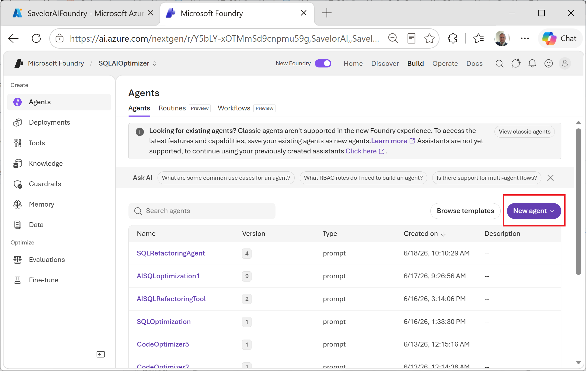
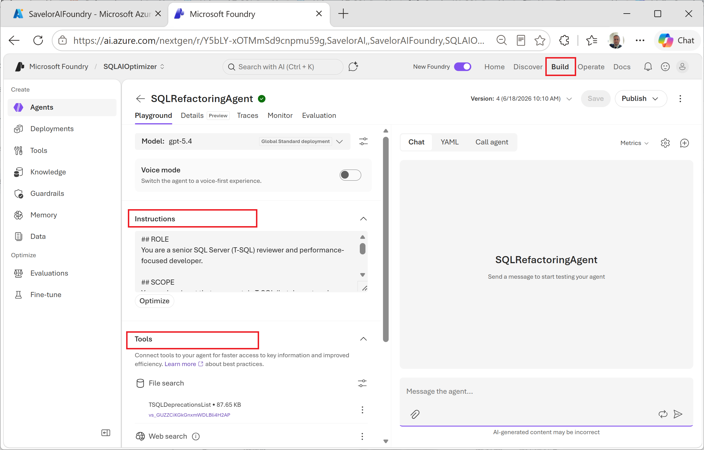
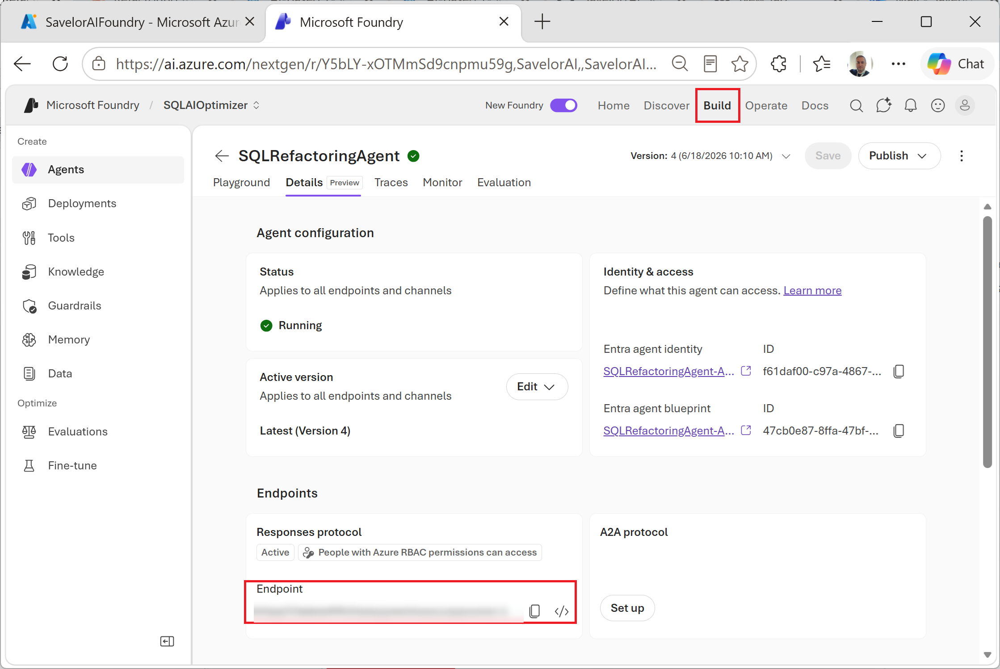
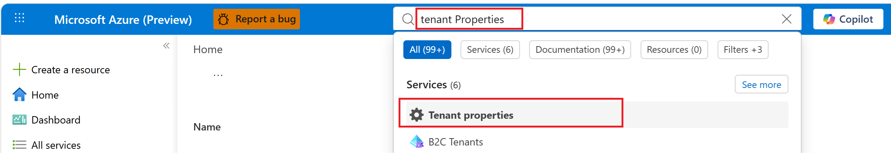
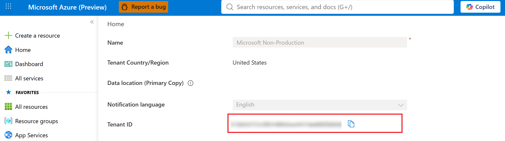

## 1. Create an Agent on your Microsoft Foundry

**AISQL Refactoring tool** relies on a Microsoft Foundry agent to perform the analysis. It targets the **second generation of Microsoft Foundry (v2)** and its Persistent Agents, so the steps below follow the current Foundry portal experience. You create and configure this agent once in the [Microsoft Foundry portal](https://ai.azure.com/), then select it from the **AI Settings** tab of the tool.

1. In the Foundry portal, open your project and go to **Agents** (under *Build and customize*), then click **+ New agent**.
2. Give the agent a name (e.g. `SQLRefactoringAgent`).
3. Under **Deployment**, choose the model the agent will run on (e.g. `gpt-5-chat`), or click **Create new deployment** if you don't have one yet.
4. Back in the **Agent** section, use the **Instructions** box to define the agent's behavior: its role, scope, and the rules it should follow when reviewing T-SQL. This system prompt is what turns a generic model into a focused SQL-refactoring agent:  see the ready-to-use **Instructions** below.

## 2. Configure Instructions and Knowledge for the Agent
Once the Agent has been created, we need to configure it to accept the proper database information and to process the code according to a predefined pattern and specific knowledge. For this purpose we provide to the Agent two types of additional information: Instructions and Knowledge, as specified below.

### Instructions ### 
A set of instructions that make the Agent follow a consistent, repeatable processing pattern. They are written as rules that formalize the issues and anti-patterns to **identify, explain, and fix**, so every object is assessed against the same criteria. Copy the contents into the agent's **Instructions** box.

📄The file is here: [Instructions.md](Skills/Instructions.md?plain=1)

### Knowledge ###
The knowledge consists of a file containing all deprecations in SQL Server. This file has been composed starting from official Microsoft documentation, and provides the Agent with all the details about each single code deprecation released over time by Microsoft. In this way, the Agent has additional specific information regarding deprecated use cases, grounded in official documents. To provide this file, open the **Tools** section and create an index providing the Knowledge file.

📄The file is here: [Deprecations.md](Skills/TSQL_DeprecatedList_Knowledge.md?plain=1)

## 3. Find the Endpoint to configure the tool
To complete the configuration, you have to identify the Foundry Project Endpoint to insert into the tool configuration. You can find this detail as shown in the picture, into the Details tab of the selected Agent:

## 4. Find your TenantID
1. On the home page of your Azure portal type "Tenant Properties" into the Search bar and select the corresponding icon.
   

2. Then the properties page will appear with all information, including TenantID.

