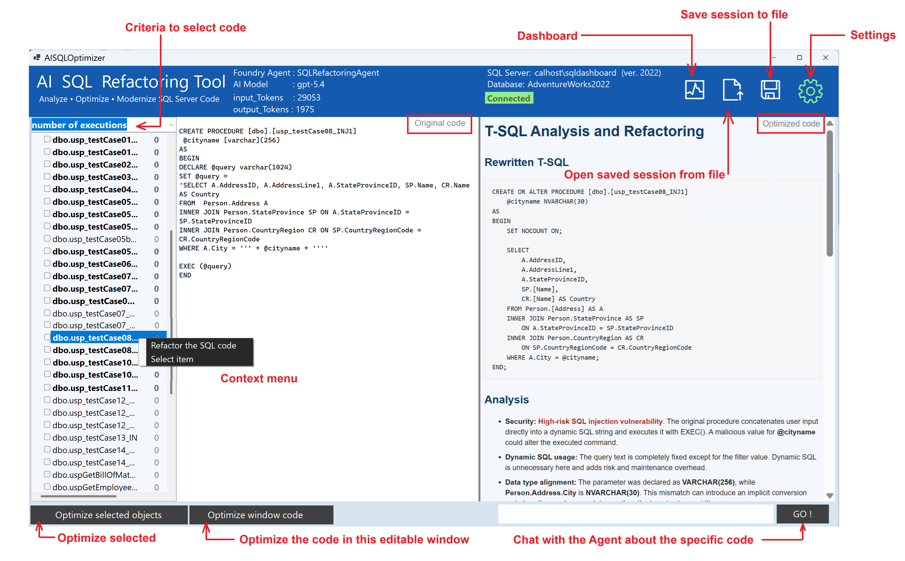
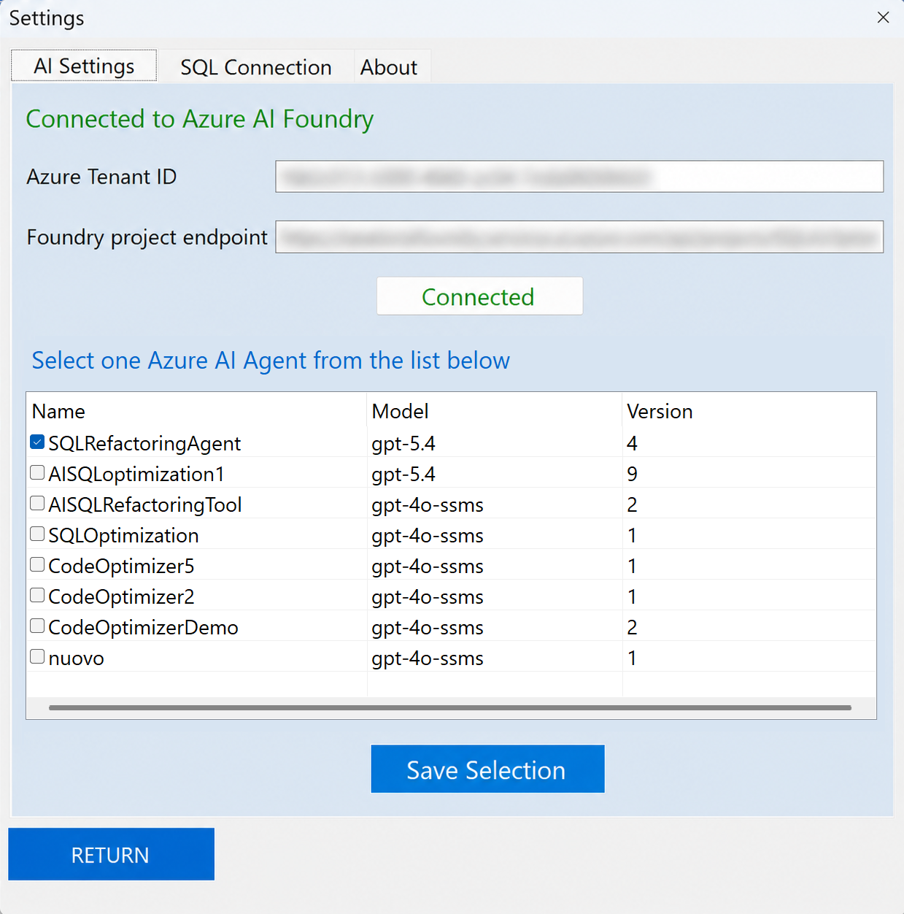
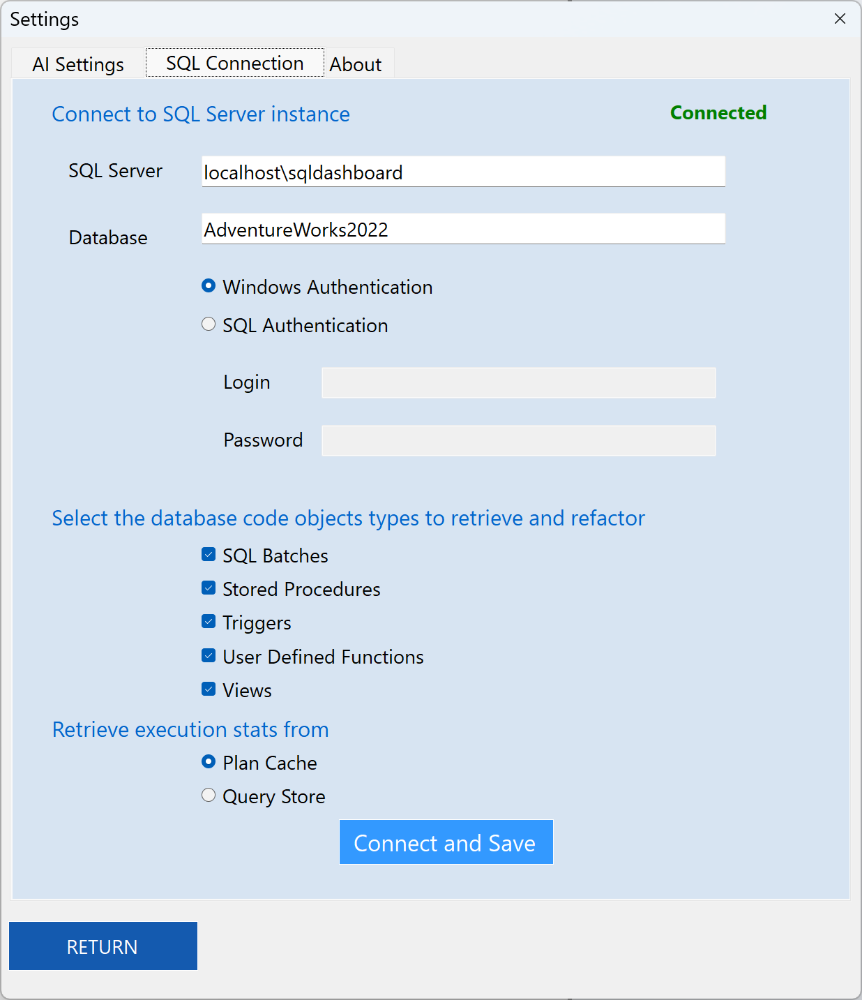
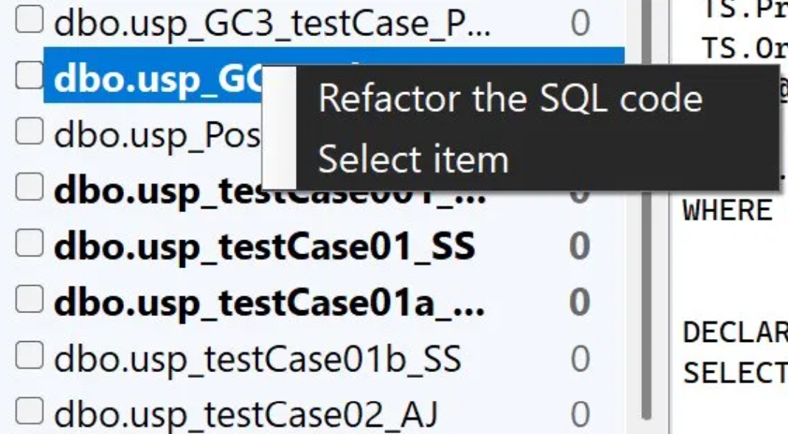
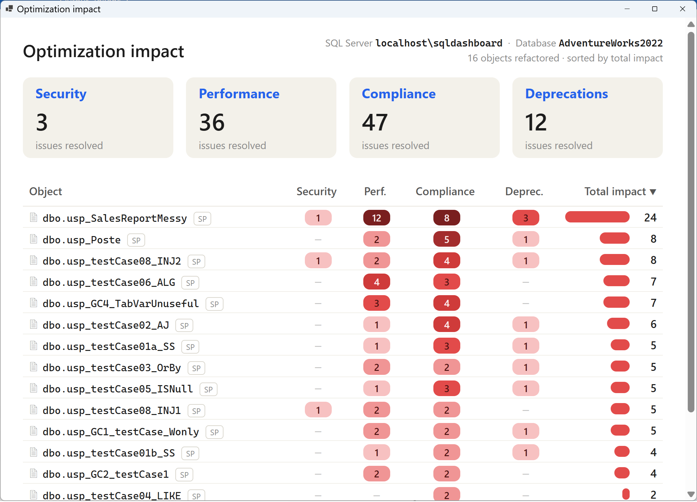

# AISQL Refactoring Tool  

## 🖥️ User Interface Overview
**AI Refactoring tool** has a very simple user interface, organized into a top status bar, three working panels, and a bottom action bar. The picture below shows the main actionable controls.
The three panels are laid out left to right following the natural workflow:
* **Left: Object navigator.** A TreeView to browse and select the SQL objects you want to optimize.
* **Center: Current code.** Shows the original T-SQL of the selected object, exactly as it is today.
* **Right: Refactored code & analysis.** Contains the new code produced by the Agent together with its full assessment: what was changed and why.

This layout gives you a convenient **side-by-side** view — original on the left/center, refactored result and rationale on the right — so you can compare the Agent's work against the source at a glance, without switching windows.

### Top Status Bar
Shows the current session context at a glance:
- **Foundry Agent**:  The Microsoft Foundry agent currently connected 
- **AI Model**:  Underlying model in use (e.g. `gpt-5-chat`).
- **Input Tokens**: total tokens sent to the agent for the current session, as reported by the model, including the agent's instructions and knowledge, and the conversation context on follow-ups.
- **Output Tokens**: total tokens generated by the agent.
- **SQL Server**:  SQL Server instance connected. This includes SQL Server On-Prem or VM on any cloud, Azure Managed Instance and Azure SQL Database
- **Database**:  The connection target, with a **Connected** status indicator.
- **Top-right icons**:  *Dashboard* (information about optimized objects),  *Open/Load* (load session content from file), *Save* (Export/Save session content to file), and *Settings* (configure connection, agent, and options).

### Left Panel — Object Selector
- The dropdown at the top sets the **sorting metric** (e.g. *CPU consumption (sec)*), so you can prioritize the most expensive objects first.
- A tree-list of SQL objects (stored procedures, functions, etc.), each with a **checkbox** for selection.
- The number beside each object reflects the selected metric.

### Center Panel — Original Code
Displays the source T-SQL of the selected object, exactly as it exists in the database — your read-only baseline before any change. The panel is also fully editable: paste code from another source (a script file, a code review, documentation) and optimize it on the fly, even without connecting to a database.

### Right Panel — Optimized Result
Shows the AI output for the selected object:
- **Optimized T-SQL Version**: the refactored, cleaned-up code.
- **Analysis**: issues and anti-patterns detected, with the rationale behind each.
- **Improvements Summary** — a concise list of the changes applied and their benefit.

### Bottom Action Bar
- **Optimize selected objects**: runs the analysis on all checked objects from the left panel (batch mode).
- **Optimize window code**: analyzes the code currently shown in the center panel.
- **Prompt field + GO!**: send a custom instruction to guide or refine the optimization.

## ⚙️ Settings

Open the **Settings** window (gear icon) to configure the AI backend and the
database connection. It has three tabs: **AI Settings**, **SQL Connection**, and **About**.

### 🧠 AI Settings
Connect the tool to your Azure AI Foundry project and choose the agent that will perform the optimizations. The Agent we want to use for this goal must be previously configured on the Azure AI Foundry portal, according to the guidelines exposed in the proper section [Microsoft Foundry Agent Setup](AGENT_GUIDE.md).

1. **Azure Tenant ID**: Enter the tenant ID of your Azure subscription.
2. **Foundry project endpoint**: Paste the endpoint URL of your Azure AI Foundry project.
3. Click **Connect** button to establish the connection. This button turns to green **Connected** when the successful connection has been estabilished.
4. From **Select one Azure AI Agent from the list below**, the table lists the available agents with their **Name**, **Model**, and **Agent Id**. Tick the checkbox next to the agent you want to use (e.g. `CodeOptimizer5`, running `gpt-4o`).
5. Click **Save Selection** to confirm the chosen agent.
6. Click **Return** to go back to the main window.

> 💡 The selected agent and model are then shown in the top status bar of the
> main window, so you always know which AI is being used.

### 🛢️ SQL Connection
Configure the SQL Server instance and database the tool will analyze, and choose which object types to retrieve.

1. **SQL Server**: enter the server instance to connect to (e.g. `localhost\sqldashboard`).
   - **Supported versions:** SQL Server 2012 and later (on-premises and IaaS), plus Azure SQL Database and Azure SQL Managed Instance (PaaS).
   - **Authentication:** SQL Authentication and Windows Integrated on SQL Server; SQL Authentication on the Azure PaaS versions.
2. **Database**: enter the target database name (e.g. `AdventureWorks2022`).
3. Choose the authentication method:
   - **Windows Authentication** — uses your current Windows credentials (no login/password needed).
   - **SQL Authentication** — enter a **Login** and **Password** for a SQL Server account.
4. Under **Select the database code object types to retrieve and refactor**, tick the object types you want to load into the main window:
   - **SQL Batches**
   - **Stored Procedures**
   - **Triggers**
   - **User Defined Functions**
   - **Views**
5. Choose where you want to retrieve performance data from. The **plan cache** (DMVs) is an in-memory snapshot: instant, zero-setup, available everywhere, but volatile — it resets on restart or memory pressure and may miss rarely-run objects. It tells you what's costing you right now. **Query Store** is persisted in the database: it survives restarts and keeps execution history over a time window, with per-query aggregates and plan-regression tracking. It needs to be enabled, but gives a stable, complete picture of what has cost you over time.
> 💡 SQL Server doesn't track execution stats (elapsed, CPU, reads) at the view level because a view's cost is absorbed into the queries that reference it. Views are listed with zero metrics and can't be ranked by cost like procedures and functions. However, views are reported in the tool as they are T-SQL code that could be optimized.
6. Click **Connect and Save** to connect and store the settings. The **Connected**
   label (top-right) turns green when the connection succeeds.
7. Click **Return** to go back to the main window. The selected objects will now appear in the left panel, ready to be optimized.

## 🧠 Running an Optimization

AISQL Refactoring tool gives you several ways to launch an optimization, plus a chat box to interact directly with the agent.

#### 1. Optimize one or more selected objects

In the left panel, tick the checkbox next to each object you want to process,
then click **Optimize selected objects**. The agent analyzes every checked object
in batch and fills the right panel with the optimized code, analysis, and summary.
Use this when you want to refactor several objects in one run.

#### 2. Optimize the code shown in the window

Click **Optimize window code** to analyze whatever T-SQL is currently displayed
in the center panel — without selecting an object from the list. Use this for
ad-hoc code: paste a snippet into the panel and optimize it on the fly.

#### 3. Right-click context menu
Right-click an object in the left panel to open a quick menu:
- **Refactor the SQL code** — runs the optimization on that single object
  immediately, without ticking its checkbox.
- **Select item** — selects the object (loads its code into the center panel)
  so you can review it before deciding to optimize.
  

#### 4. Interacting with the agent (prompt box + GO!)

The text box at the bottom lets you send a free-text instructions to the agent to
guide or refine the optimization on the selected objects on the left TreeView. Type your request — for example
"focus on indexing", or "explain the changes in more detail" — and click **GO!** to send it. Each optimized object is drawn in bold within the TreeView, and is optimized on a separate conversation with the Agent. Selecting it on the TreeView, you can recall the optimization context and continue to interact with the Agent on that specific object and context, further refining the optimization.

Use it to steer the result toward what you need, or to ask follow-up questions
about an optimization the agent has already produced.

## 💾 Saving and Resuming a Session

AISQL Refactoring Tool lets you save the current session to a file and reload it later,
so you can pause your work and pick it up exactly where you left off. The two
icons are in the top-right corner of the main window.

| Icon | Action | Description |
|---|---|---|
|  | **Save a Session** | Click the **Save** icon to write the current session to a file, including the loaded objects, the generated optimizations, and the analysis results. Choose a location and file name when prompted. Save regularly so you don't lose the work done on large batches. SQL Server name and Database name are saved together with session information. |
|  | **Load a Session** | Click the **Load** icon to open a previously saved session file. The objects and their optimization results are restored into the panels, letting you review them or continue refactoring without re-running the agent.  **Note:** when loading a session file, the loaded content overrides the current session data.  - If the application is connected to the same server and database saved in the session, optimizations can leverage schema and index metadata. - If the application is not connected to SQL Server, the agent can still optimize the code, but without schema information. - If the application is connected to a different server or database, pay attention because there could be a mismatch between the code and the database schema, which can affect optimization quality. |

#### Dashboard
The Dashboard summarizes all the objects (stored procedure, functions, etc) that have been assessed, with the related details, showing the number of optimizations implemented by the Agent on each single topic. Starting from this view you can start planning the items to refactor to improve the application.

